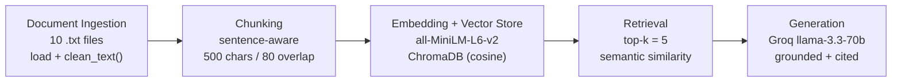

# Planning - The Unofficial Guide

## Domain

Student reviews of **Computer Science professors at Arkansas State University (A-State)**, collected from RateMyProfessors. This kind of knowledge is hard to find through official channels: the course catalog and registrar tell you what a class covers and when it meets, but never which professor curves heavily, whose exams track the lecture slides instead of the textbook, who's a tough grader, or which "basic" required course is actually brutal. That signal only lives in student-to-student reviews. My system makes ten professors' worth of that crowd knowledge searchable, so a student can ask a plain-language question - "who should I take for an easy A?", "is Causey hard?" - and get a grounded, cited answer.

## Documents

Ten professor pages from RateMyProfessors, all in A-State's Computer Science department (department id 11, school id 13755). One `.txt` file per professor (filename = last name), each containing the professor's name, overall stats, and every written review tagged with its course code and difficulty. Collected manually because RateMyProfessors blocks automated scraping.

- `hammerand.txt` - Edward Hammerand (11 reviews; 5.0/5, easy, beloved) - https://www.ratemyprofessors.com/professor/13047
- `causey.txt` - Jason Causey (22 reviews; 4.2/5, course-dependent difficulty) - https://www.ratemyprofessors.com/professor/713362
- `jiang.txt` - Hai Jiang (6 reviews; 3.0/5, hard but respected) - https://www.ratemyprofessors.com/professor/1109121
- `spencer.txt` - Jeanette Spencer (7 reviews; 2.6/5, contradictory) - https://www.ratemyprofessors.com/professor/745227
- `scrivner.txt` - Gidget Scrivner (12 reviews; 2.4/5, mostly negative) - https://www.ratemyprofessors.com/professor/1391506
- `clay.txt` - Mitchel Clay (4 reviews; 5.0/5, computer organization / architecture) - https://www.ratemyprofessors.com/professor/3079478
- `mcelhaney.txt` - Amber McElhaney (2 reviews; 5.0/5, easy applications/Office) - https://www.ratemyprofessors.com/professor/1390297
- `ray.txt` - S.D. Ray (2 reviews; listed in CS, reviewed for econ/accounting courses) - https://www.ratemyprofessors.com/professor/1353257
- `huang.txt` - Xiuzhen Huang (3 reviews; 1.3/5, Analysis of Algorithms) - https://www.ratemyprofessors.com/professor/1109118
- `shanlever.txt` - Susan Shanlever (5 reviews; 1.4/5, MIS1203, strongly negative) - https://www.ratemyprofessors.com/professor/1404468

The set deliberately spans easy↔hard, loved↔hated, and several course levels (intro, programming, upper-level theory, applications) so it can answer a range of different questions rather than ten variations of one. ~74 reviews total.

## Chunking Strategy

**500 characters per chunk, 80-character overlap, split on sentence boundaries** (not fixed cuts), dropping fragments under 40 characters. Reasoning: these are short, opinion-dense reviews - most are 1–4 sentences (≈200–400 characters). Each document is chunked independently, so a chunk never mixes two professors; at 500 characters a chunk holds one or two complete reviews of the *same* professor, which keeps a full opinion intact while staying specific enough to match a pointed query. The 80-character overlap stops a thought that straddles a boundary (e.g. a sentence about exam format) from being split so it's unretrievable from either side.

How I'd know it's wrong: too-small chunks would surface fragments like "His tests are heavily" that answer nothing; too-large chunks would merge several unrelated opinions and dilute similarity so nothing matches precisely. After embedding I check the printed total chunk count - I expect roughly 45–55. If it lands well under that, I'll reduce chunk size toward **300** (≈ one review per chunk, which suits review text) and update this section.

## Retrieval Approach

- **Embedding model:** `all-MiniLM-L6-v2` via sentence-transformers - runs locally, no API key or rate limits, 384-dimensional, fast, and strong enough for short English text.
- **Vector store:** ChromaDB, cosine distance.
- **Top-k:** 5 per query.

Five chunks is enough to cover a question that spans two or three reviews without flooding the prompt with loosely related text that pulls the answer off-target; too few risks missing the one relevant chunk entirely, too many invites the model to latch onto a tangentially similar review. Semantic search matters here because students phrase questions differently from how reviews are written ("easy A" vs. "I passed without studying", "tough grader" vs. "wants very specific answers") - embeddings match on meaning, not shared keywords.

If I were deploying this for real users and cost weren't a constraint, I'd weigh a larger hosted embedding model (e.g. OpenAI `text-embedding-3-large` or a Voyage model) for better accuracy on domain jargon and longer context, plus stronger multilingual handling - several reviews are written by ESL students with non-standard phrasing that a bigger model embeds more robustly. The tradeoffs against MiniLM are latency, per-query cost, and the privacy/operational overhead of sending text to an API instead of embedding locally.

## Evaluation Plan

Five test questions with expected answers, grounded in the corpus. I've deliberately included questions I expect to be hard, so the evaluation surfaces real weaknesses rather than only successes.

1. **Which CS professors do students recommend for an easy A?**
   *Expected:* Hammerand ("Easy A", difficulty 2.2, 100% would take again), Clay ("very easy class"), McElhaney ("super easy"), and Causey's intro courses (CS1013 / INTROTOCOMP, "easy peezy", difficulty 1). *(Anticipate: accurate - multiple explicit sources.)*

2. **How many exams does Xiuzhen Huang's Analysis of Algorithms (CS4713) course have, and what are they?**
   *Expected:* Two - a midterm and a final (one reviewer mentions scoring 20% on the midterm but still passing with a B). *(Anticipate: accurate - a precise fact contained in one chunk.)*

3. **Is Jason Causey's class hard?**
   *Expected:* It depends on the course. His upper-level programming courses (CS2114 structured programming, CS2124 object-oriented) are tough - difficulty 4–5, "tough grader", "hardest class I've taken", tests need very specific answers. His intro/gen-ed courses are easy - difficulty 1, "easy A". *(Anticipate: partially accurate - the system will likely flatten this into one verdict instead of separating courses.)*

4. **Is Jeanette Spencer's class easy or hard?**
   *Expected:* Students disagree - several call it an easy "cushion class" with light work, while others say the tests are "really hard" and call her a poor teacher; multiple note she "curves big time". A correct answer should reflect the conflict, not pick one side. *(Anticipate: partially accurate - likely sides with whichever view dominates the retrieved chunks.)*

5. **Is Hai Jiang a harder professor than Edward Hammerand?**
   *Expected:* Yes - Jiang is 3.0/5 with difficulty 4 ("study like hell", "worst nightmare", large research-paper projects); Hammerand is 5.0/5 with difficulty 2.2 ("easy A"). *(Anticipate: my failure case - the comparison needs context from two different documents, but top-k similarity tends to return chunks dominated by one professor, so the system may answer about only one and never actually compare.)*

**Out-of-scope check** (for the refusal demo, not one of the five): *"Who teaches the database systems course?"* - not covered by any document. The system should say it doesn't have enough information rather than invent an answer.

## Anticipated Challenges

1. **Contradictory and course-dependent reviews.** Several professors are both praised and panned in the same file (Spencer), and one professor's difficulty depends heavily on which course you take (Causey). Retrieval that returns a one-sided slice will produce a confidently oversimplified or wrong answer.
2. **Comparison / multi-document questions.** Questions that compare two professors need context from two files, but similarity search ranks individual chunks, so it can return five chunks all about one professor and miss the other entirely.
3. **Off-domain content in the corpus.** A few professors are listed under CS but reviewed for non-CS courses (Ray - econ/accounting; Shanlever - MIS), which can surface for a generic "easy class" query and muddy a CS-specific answer.

(Also: short reviews mean a low total chunk count - addressed in the chunking section - and ESL phrasing in some reviews can weaken embedding matches.)

## AI Tool Plan

I used Claude for two parts of this project:

1. **Document preparation.** I collected each professor's reviews from RateMyProfessors by hand (the site blocks automated scraping), then gave Claude the raw page text and had it strip boilerplate - navigation, rating widgets, the "Similar Professors" sidebar, vote counts - and reformat each into a consistent `.txt`: a professor header plus each review tagged with its course code and difficulty. I reviewed every file, kept the verbatim review text (typos included), and dropped the tag chips for consistency across files. Input: the raw pasted page + my data-format spec. Output: one cleaned `.txt` per professor.

2. **Pipeline code.** I gave Claude this `planning.md` (domain, chunking strategy, retrieval approach, architecture diagram) and had it implement the pipeline in `rag.py` - loading and cleaning the `.txt` files, sentence-aware chunking at 500/80, embedding with `all-MiniLM-L6-v2`, storing in ChromaDB with source metadata, top-k retrieval, and grounded generation through Groq with a strict context-only system prompt and programmatic source citation - plus a Gradio interface in `app.py`. I read through the generated code to confirm the grounding instruction is *enforced* (not merely suggested) and that source attribution is built from chunk metadata rather than left to the model.

## Architecture

